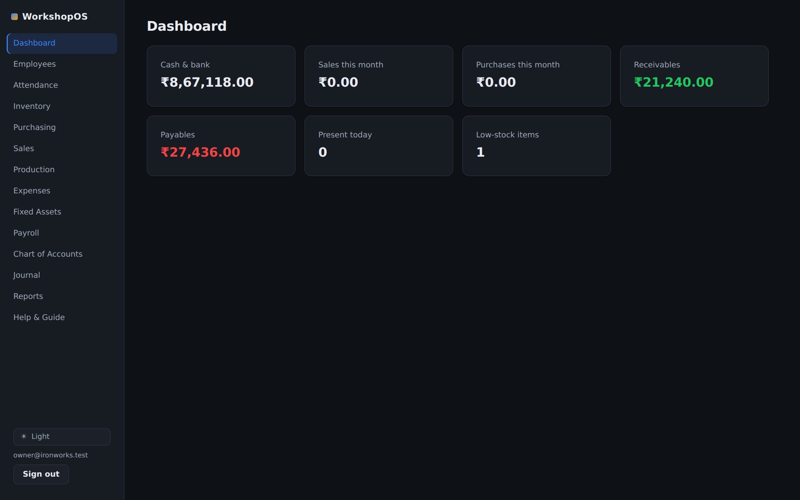
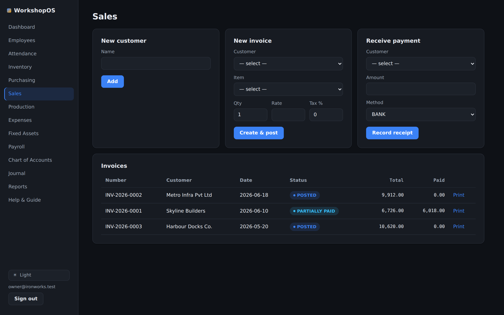
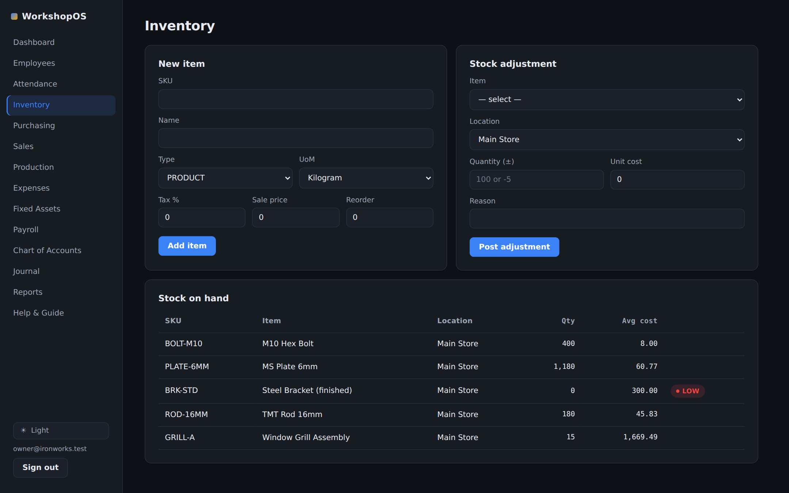
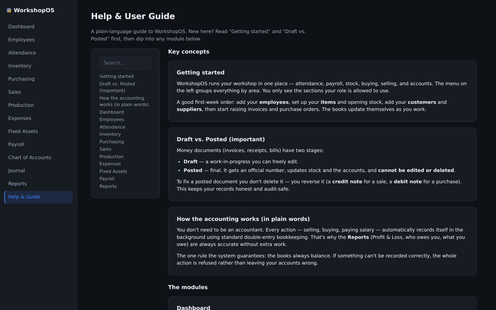
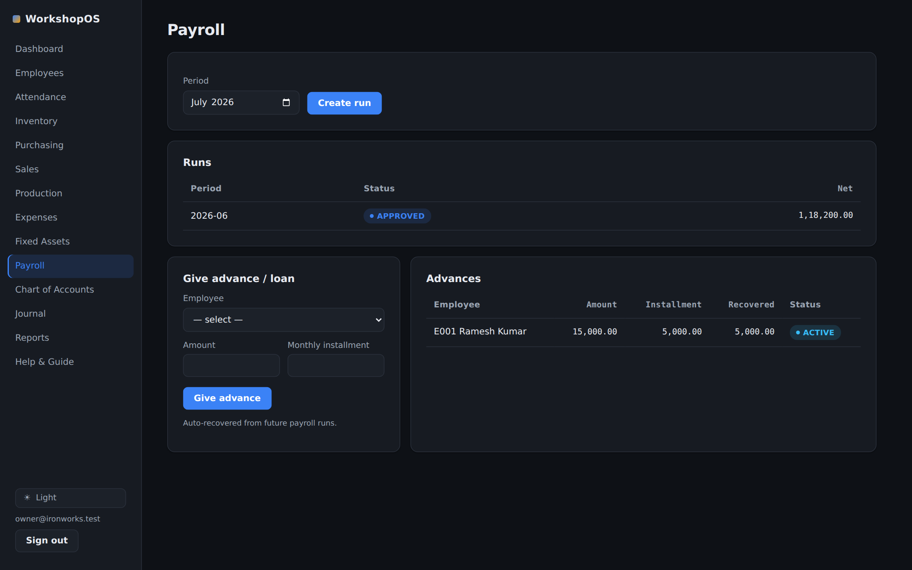
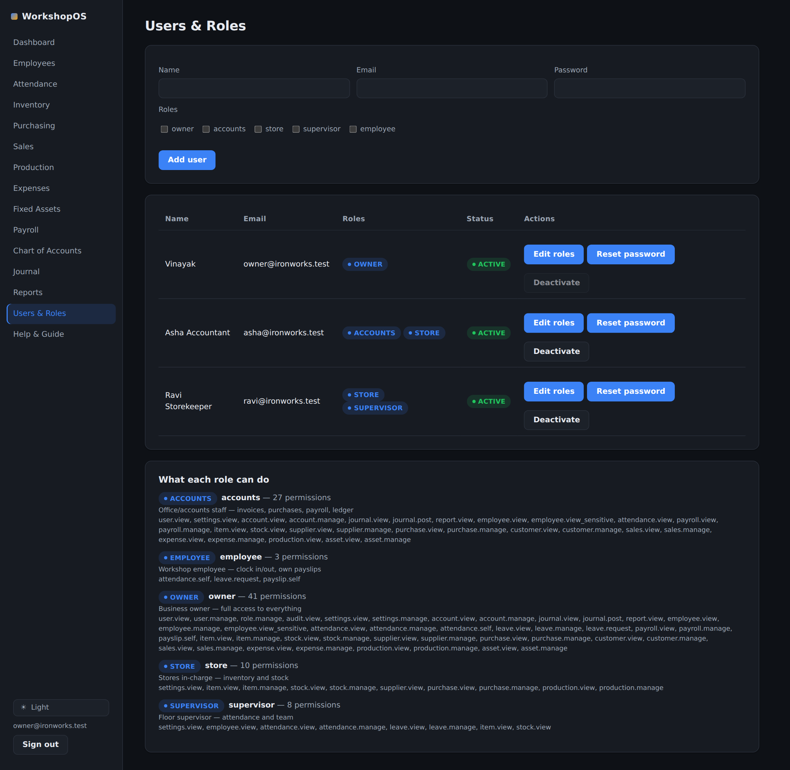

# WorkshopOS

> Open-source business management software for small rig / workshop / fabrication businesses.
> One place for attendance, payroll, inventory, purchasing, invoicing, and basic accounting.

**Status:** Phases 0–3 implemented and validated end-to-end. Attendance, payroll (with advances), inventory, purchasing, sales, **production/job costing**, **fixed assets & depreciation**, quotations, returns, expenses, and full accounting all work — with the double-entry ledger staying balanced across every transaction type (verified against a live database and in a real browser). See the phase status docs below. A few items that need external systems (email/SMTP, biometric hardware, e-filing formats) are scoped in [`docs/PHASE-3-STATUS.md`](docs/PHASE-3-STATUS.md).

---

## 🚀 Run it yourself — no coding needed (about 10 minutes)

You do **not** need to be a programmer. If you can install an app and copy‑paste one line, you can run WorkshopOS on your own computer or office server.

### Step 1 — Install Docker Desktop (one time)

Docker is a free program that runs WorkshopOS for you in the background.

- **Windows or Mac:** download and install **Docker Desktop** from <https://www.docker.com/products/docker-desktop/>, then open it once so it's running (you'll see a small whale icon).
- **Linux:** install **Docker Engine** and the **Compose plugin** from <https://docs.docker.com/engine/install/>.

### Step 2 — Get the WorkshopOS files

On the project's GitHub page, click the green **Code** button → **Download ZIP**, then unzip it. (Or, if you know git: `git clone <repo-url>`.)

### Step 3 — Start it

Open a terminal — **PowerShell** on Windows, or **Terminal** on Mac/Linux — go into the unzipped folder, and run this one line:

```bash
docker compose up -d --build
```

The **first** time takes about 5–10 minutes while it downloads and builds everything (later starts take seconds). When it finishes, it keeps running in the background.

### Step 4 — Open it in your browser

Go to **<http://localhost:8080>**. You'll see a short **setup wizard** — enter your business name, your currency and timezone, your financial year, and create your owner login. That's it — you're in. 🎉

New to it? Every screen is explained inside the app under **Help & Guide** in the menu.

### Everyday commands

| I want to… | Run this in the project folder |
|------------|-------------------------------|
| Stop it (your data is kept) | `docker compose down` |
| Start it again | `docker compose up -d` |
| See it's running | open <http://localhost:8080> |
| Update to a newer version | download the new files, then `docker compose up -d --build` |

Your data lives safely in Docker even when it's stopped. To **back up**, copy the Docker volume `pgdata` (your accountant or IT person can do this in seconds), or export reports to CSV from the **Reports** page.

### A note on safety
Out of the box it uses simple built‑in passwords so it "just works" on your own machine. **If you ever put it on the internet** (so staff can reach it from home), first set strong secrets and enable HTTPS — copy `.env.example` to `.env` and follow the notes there and in [`docs/05-security-and-ops.md`](docs/05-security-and-ops.md). For a single office PC on your local network, the defaults are fine.

### If something doesn't work
- **"Port already in use"** — something else is using port 8080. Stop it, or change `8080` in `docker-compose.yml` to e.g. `9090` and open <http://localhost:9090>.
- **The first build failed on a slow network** — just run `docker compose up -d --build` again; it resumes.
- **Blank page** — give it a minute after starting, then refresh; the database sets itself up on first run.

---

## 🎬 Demo video

Two short walkthroughs of the running app:

- **[`docs/demo/workshopos-testreel.mp4`](docs/demo/workshopos-testreel.mp4)** — produced with **[testreel](https://github.com/greentfrapp/testreel)** from the definition in [`docs/demo/recording.json`](docs/demo/recording.json): a polished tour (browser window chrome, gradient backdrop, animated cursor) through sign-in and every module, ending with the dark/light theme toggle.
- **[`docs/demo/workshopos-demo.mp4`](docs/demo/workshopos-demo.mp4)** — a captioned version that also posts a live invoice and shows the dashboard update in real time.

## Screenshots

| | |
|---|---|
| **Dashboard** — the morning overview | **Sales** — invoices, payments, printable bills |
|  |  |
| **Inventory** — stock, costs, low‑stock flags | **Reports** — profit & loss, always up to date |
|  |  |
| **Payroll** — runs, payslips, advances | **Help & Guide** — built‑in user manual |
|  |  |
| **Users & Roles** — add staff logins, assign roles | |
|  | |

More in [`docs/screenshots/`](docs/screenshots/) — employees, attendance, purchasing, production, fixed assets, the chart of accounts, and the light theme.

---

## Why this exists

Small workshop businesses (machine shops, fabrication units, rig builders, repair garages) typically run on a pile of Excel sheets. That works until it doesn't: stock counts drift, payroll math gets copied wrong, invoices go missing, and nobody can answer "did we actually make money last month?"

WorkshopOS is a single, self-hostable app that covers the day-to-day operations of a ~10-person workshop:

- 🕘 **Attendance** — clock in/out, shifts, overtime, leave
- 💰 **Payroll** — salary structures, attendance-driven pay, statutory deductions, payslips
- 📦 **Inventory** — products, raw material, spare parts, multi-location stock
- 🛒 **Purchasing** — suppliers, purchase orders, goods receipt, stock-in
- 🧾 **Sales & Invoicing** — quotations, customer invoices, payments
- 📒 **Accounting** — double-entry ledger, chart of accounts, basic financial reports

## Should you build this, or use ERPNext?

Be honest with yourself before writing code. A mature open-source ERP — **[ERPNext](https://erpnext.com/)** (Frappe) — already does *everything* on your list, plus manufacturing, and can be self-hosted with Docker in an afternoon. Odoo Community and Tryton are similar.

**Use an existing ERP if:** you mainly need it to *work* and you're willing to adapt your process to the software's. This is the right call for most 10-person shops.

**Build WorkshopOS if:** you want full control of the data model and UX, you have (or are) a developer who will own it, your workflow is unusual enough that configuring an ERP is as much work as building, or this is also a learning/portfolio project. This repo assumes you've chosen to build.

See [`docs/00-overview.md`](docs/00-overview.md) for the full build-vs-buy analysis.

## The plan, in order

| Doc | What's in it |
|-----|--------------|
| [00 — Overview & scope](docs/00-overview.md) | Goals, non-goals, personas, build-vs-buy, success criteria |
| [01 — Architecture](docs/01-architecture.md) | Tech stack, system design, project layout, key decisions |
| [02 — Data model](docs/02-data-model.md) | Entities, relationships, the double-entry ledger, schema notes |
| [03 — Modules](docs/03-modules.md) | Feature-by-feature spec for every module |
| [04 — API design](docs/04-api-design.md) | REST conventions, key endpoints, auth |
| [05 — Security & operations](docs/05-security-and-ops.md) | RBAC, backups, deployment, self-host vs cloud |
| [06 — Roadmap](docs/06-roadmap.md) | Phased delivery: MVP → v1 → v2, estimates, milestones |
| [Phase 0 status](docs/PHASE-0-STATUS.md) | The foundation scaffold |
| [Phase 1 status](docs/PHASE-1-STATUS.md) | The MVP — modules built and how they were validated |
| [Phase 2 status](docs/PHASE-2-STATUS.md) | Workflow round-out: reports, printable invoices, quotations, returns, stock count, advances, expenses |
| [Phase 3 status](docs/PHASE-3-STATUS.md) | Depth: production/job costing, fixed assets & depreciation |
| [Design system](docs/DESIGN-SYSTEM.md) | UI/UX language: principles, tokens, components, patterns (living guide: `docs/design/styleguide.html`) |
| [DEVELOPMENT.md](DEVELOPMENT.md) | How to install, run, and develop locally |

## Quick mental model

```
                         ┌──────────────────────────┐
                         │      Web app (React)      │
                         │  staff portal + admin UI  │
                         └─────────────┬────────────┘
                                       │ HTTPS / REST
                         ┌─────────────▼────────────┐
                         │     API (NestJS/TS)       │
                         │  auth · RBAC · services   │
                         └─────────────┬────────────┘
              ┌────────────────────────┼────────────────────────┐
              │                        │                         │
        ┌─────▼─────┐         ┌────────▼────────┐        ┌───────▼───────┐
        │ PostgreSQL│         │   Redis (jobs   │        │ Object store  │
        │  (system  │         │   + sessions)   │        │ (invoices,    │
        │  of record)│        └─────────────────┘        │  docs, photos)│
        └───────────┘                                    └───────────────┘
```

Everything is **double-entry at the core**: inventory movements, payroll runs, and sales all post to the same ledger so "basic accounting" is a consequence of the design, not a bolt-on.

## Recommended hosting

A single **$10–20/month VPS** (2 vCPU / 4 GB RAM) running Docker Compose comfortably handles 10 employees with room to spare. Self-hosting is worth it here; you keep your payroll and customer data, and the running cost is a rounding error. See [`docs/05-security-and-ops.md`](docs/05-security-and-ops.md).

## License

Intended to be released under the **MIT** or **AGPL-3.0** license (decide before first public release). AGPL keeps hosted forks open; MIT maximizes adoption. TBD.
